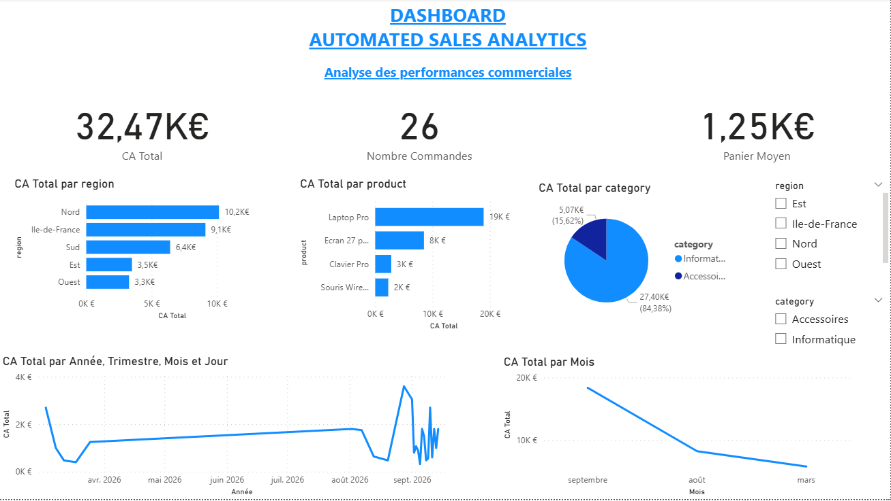

# 📊 Automated Sales Analytics

Projet Data Analytics permettant d'automatiser le traitement et l'analyse de données commerciales, depuis l'import des données jusqu'à leur visualisation dans Power BI.

## 🎯 Objectif du projet

L'objectif est de construire un pipeline permettant de :

- importer des données de ventes ;
- transformer et préparer les données automatiquement ;
- stocker les données dans PostgreSQL ;
- analyser les performances commerciales avec SQL ;
- construire un dashboard interactif dans Power BI.

## 🏗️ Architecture

```text
Sales CSV
    ↓
   n8n
    ↓
Transformation des données
    ↓
PostgreSQL
    ↓
   SQL
    ↓
Power BI
    ↓
Dashboard interactif
```

Docker est utilisé pour exécuter les services PostgreSQL et n8n.

## 🛠️ Technologies utilisées

- Power BI
- PostgreSQL
- SQL
- n8n
- Docker
- Git / GitHub

## 📊 Indicateurs analysés

Le dashboard permet notamment de suivre :

- Chiffre d'affaires total
- Nombre de commandes
- Panier moyen
- Chiffre d'affaires par produit
- Chiffre d'affaires par région
- Chiffre d'affaires par catégorie
- Évolution du chiffre d'affaires dans le temps

## ⚙️ Pipeline de données

Le workflow n8n lit les données commerciales depuis le fichier CSV.

Les données sont ensuite transformées, notamment avec le calcul :

```text
Revenue = Quantity × Unit Price
```

Les données sont ensuite insérées ou mises à jour dans PostgreSQL.

Power BI se connecte à la base PostgreSQL afin de construire les indicateurs et visualisations.

## 📈 Dashboard Power BI



Le dashboard contient des filtres interactifs permettant notamment d'analyser les performances par région et par catégorie.

## 📁 Structure du projet

```text
automated-sales-analytics/
├── data/
│   └── sales.csv
├── n8n/
│   └── workflow.json
├── sql/
│   └── analysis.sql
├── powerbi/
│   └── Automated_Sales_Analytics.pbix
├── screenshots/
│   └── dashboard.png
└── README.md
```

## 🔎 Exemple d'analyse SQL

```sql
SELECT
    region,
    SUM(revenue) AS total_revenue
FROM sales
GROUP BY region
ORDER BY total_revenue DESC;
```

Cette requête permet d'identifier les régions générant le plus de chiffre d'affaires.

## 🚀 Compétences mises en pratique

Ce projet m'a permis de travailler sur :

- préparation et transformation de données ;
- requêtes SQL ;
- création et analyse de KPI ;
- modélisation et visualisation avec Power BI ;
- automatisation d'un pipeline avec n8n ;
- utilisation de PostgreSQL avec Docker ;
- debugging d'un pipeline de données ;
- versionnement avec Git et GitHub.

## 👤 Auteur

**Ketsia Botuwa**
